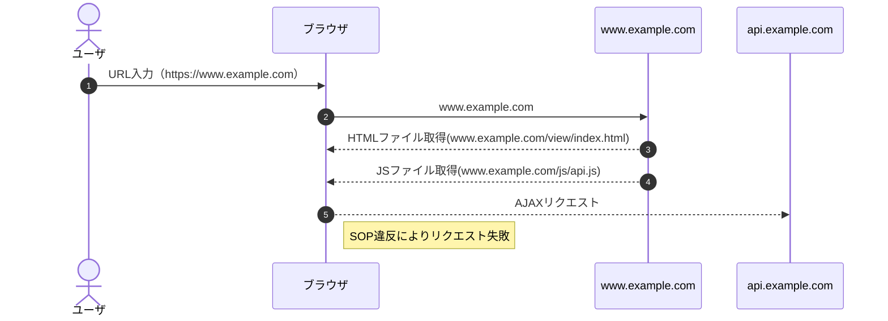
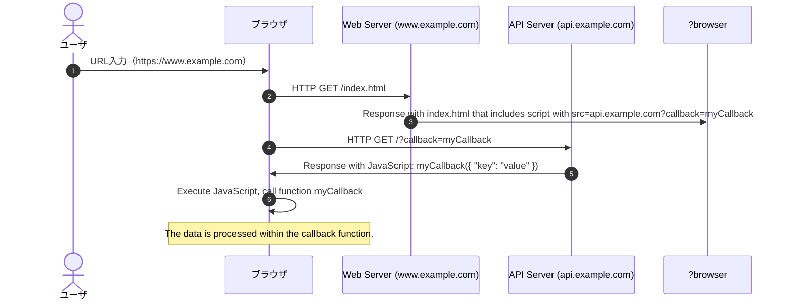
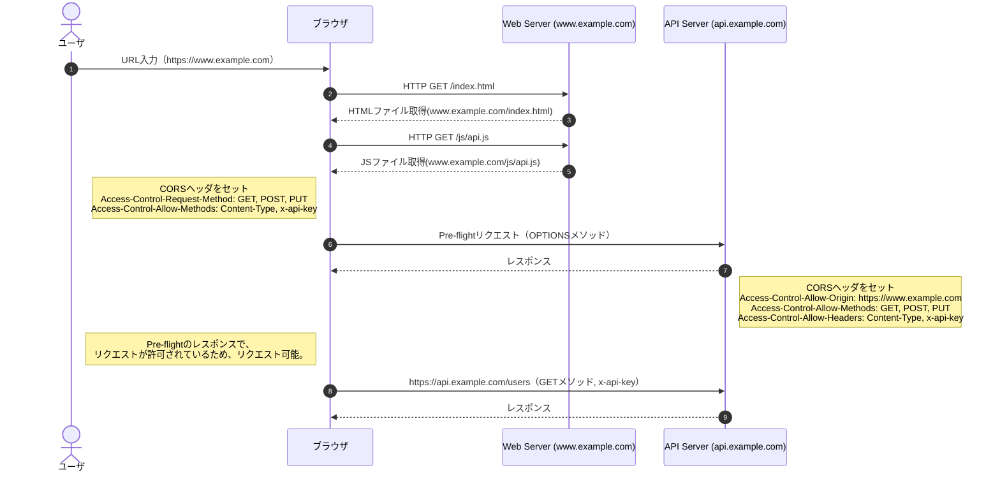
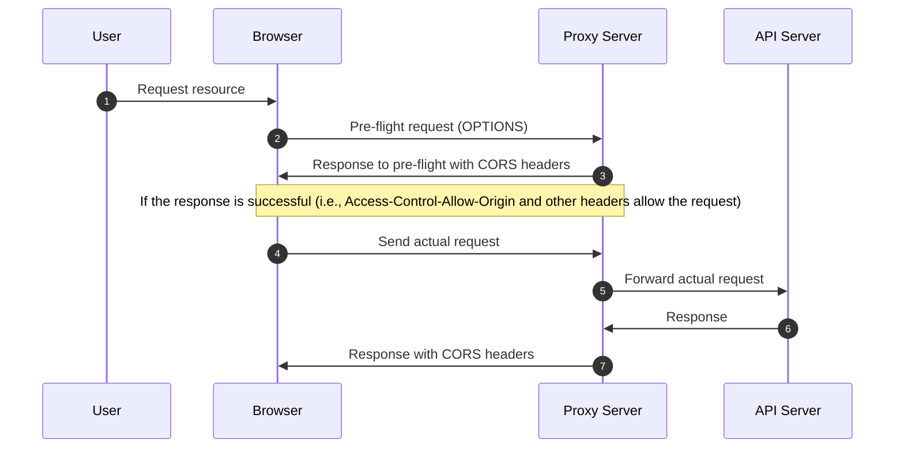
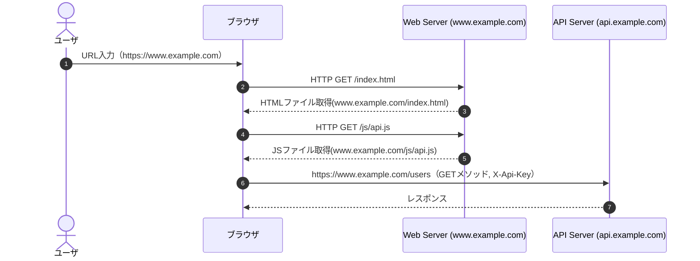
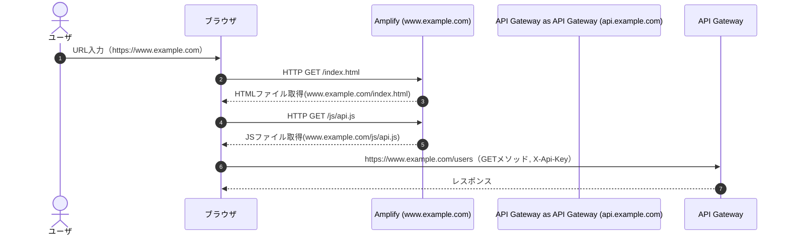

## CORSとは

CORS（Cross-Origin Resource Sharing, オリジン間リソース共有）は、自身のオリジンから見た、別のオリジン（クロスオリジン）からのリクエストを許可するか決定する仕組みです。

例えば、www.example.comから取得したjavascriptのファイルが、api.example.comというAPIにAJAXリクエストを送って情報を取得するケースを考えた場合、api.example.comのAPIがCORS対応していない場合、Webブラウザが持つセキュリティ機能であるSOP（同一オリジンポリシー Same Origin Policy）と呼ばれる仕組みにより、api.example.comにAJAXリクエストはブロックされてしまいます。

リクエストをブロックされないためには、api.example.com側でCORSの設定をする必要があります。

## SOP違反の例

CORSが必要となる理由はブラウザに実装されたSOPの仕組みがクロスオリジンリクエストをブロックするためです。SOPが同一オリジンとみなす条件は以下になります。
- 同一プロトコル
- 同一ドメイン
- 同一ポート

下記ケースの場合、SOPに違反しないためにはAJAXリクエストのURIは
- プロトコル：HTTPS
- ドメイン：www.example.com
- ポート：443

であることが条件となりますが、AJAXリクエストのURIのドメインがapi.example.comになっているため、SOP違反となり、AJAXリクエストが送信できません。

## 同一オリジン判断の例

以下の表は、各行の URL が http://store.company.com/dir/page.html と同じオリジンであるかを比較したものです。

| URL                                        | 結果     | 理由                           |
|--------------------------------------------|----------|-------------------------------|
| http://store.company.com/dir2/other.html   | 同一オリジン | パスだけが異なる            |
| http://store.company.com/dir/inner/another.html | 同一オリジン | パスだけが異なる            |
| https://store.company.com/page.html        | 不一致    | プロトコルが異なる             |
| http://store.company.com:81/dir/page.html  | 不一致    | ポート番号が異なる (http:// は既定で 80 番ポート) |
| http://news.company.com/dir/page.html      | 不一致    | ホストが異なる               |

## SOPの目的
同一オリジンポリシー（SOP）は主に以下のような潜在的な攻撃を防ぐ目的で作られました.

- クロスサイトスクリプティング（XSS）
XSSは、攻撃者が悪意のあるスクリプトをウェブサイトに注入し、そのスクリプトが他のユーザーのブラウザ上で実行される攻撃です。SOPはあるオリジンのスクリプトが他のオリジンのリソースにアクセスすることを制限することで、この種の攻撃を防ぐ役割を果たします。

- クロスサイトリクエストフォージェリ（CSRF）
CSRFは、攻撃者がユーザーのブラウザを使って、そのユーザーが認証済みの状態で訪問するウェブサイトに対して意図しないリクエストを送らせる攻撃です。SOPがなければ、攻撃者はあるウェブサイトから他のウェブサイトへのリクエストを行い、ユーザーのデータにアクセスしたり操作したりする可能性があります。

- クリックジャッキング
クリックジャッキングは、攻撃者が透明なレイヤーまたはフレームを用いて、ユーザーに気づかれずに本来とは異なるリンクやボタンをクリックさせる攻撃です。SOPにより、あるオリジンのページから他のオリジンのページを操作することが制限されます。

## SOPの適用対象・非適用対象
Same Origin Policyが適用されるのは以下の場合である。
- JavaScript での非同期通信（Ajax, いわゆる XMLHttpRequest や Fetch API を使った通信）
- CSS での @font-face を使った Web フォントの読み込み
- WebGL テクスチャの読み込み
- canvas の drawImage() を用いた画像やビデオフレームの描画
- 画像から CSS シェイプの生成

適用されないのは以下の場合である
- imgタグのsrc属性で読み込んだ画像
- linkタグのhref属性で読み込んだ CSS
- scriptタグのsrc属性で読み込んだ JavaScript
- formタグの action 属性で設定した送信先 URL
- video, audio タグのsrc属性で読み込んだマルチメディアファイル
- iframe, frame タグのsrc属性での別サイトコンテンツの読み込み
X-Frame-Options の設定によっては読み込みがブロックされます
JavaScript を用いて iframe 内のドキュメントにアクセスすることはできません

## Public APIのSOP対応

Google Maps APIのようなJavaScriptライブラリは、その内部実装により、SOPの制約を遵守しつつ、ブラウザからサーバーへのリクエストを行うことが可能になっている。これはライブラリの開発者が、CORSのようなメカニズムを利用してSOPの制約を遵守する実装を行っているからである。

:::note info
Google Maps APIは発行したAPIキーを使用して、リクエストを行うため、APIキーを不正利用されないようにする必要がある。
一般的にはapi keyに対してgoogle mapの管理コンソールからアクセス元（referer）を設定することで、制限を行い運用することで不正利用の対応を行うことができる。
また、APIの利用範囲の制限をかけることで、APIキーが不正に漏洩したとしても、そのキーで利用できるAPIの種類が制約され、被害を最小限に抑えることができる。
:::

また、フロントエンドからのクロスオリジンリクエストを許可しないポリシーのAPIについてはCORSサポートをしていないものもある。
- Twitter API
- 

一方で、一般開発者が、ブラウザからアクセスするWebサーバとAPIサーバを分けて構築し、Webサーバから取得したjavascriptからAPIサーバに対してAJAXなどで非同期リクエストする際には、SOPの問題を考える必要がある。

SOP対策としては、一般的には以下のような回避方法が存在する。

- JSONP（JSON with Padding）：
この手法は、scriptタグを使ってJSONデータをロードする方法です。JSONPはCORSによる制約を回避できますが、セキュリティ上のリスクがあるため、現在ではあまり推奨されていません。
- CORSヘッダー：
サーバー側で適切なCORSヘッダーを設定することで、異なるオリジンからのリクエストを許可することができます。Google Maps APIのような一部のサービスでは、サーバー側でこれらのヘッダーが適切に設定されています。
- プロキシサーバー：
この手法は、クライアントとサーバーの間に別のサーバー（プロキシ）を立て、プロキシがクライアントの代わりにサーバーと通信を行う方法です。これにより、ブラウザが認識する"オリジン"を変更することができ、SOPを回避できます。
- サーバーサイド通信：
この手法は、クライアントではなくサーバー側でAPIリクエストを行う方法です。これにより、ブラウザのSOPやCORSの制約を完全に回避することができます。

### JSONP（JSON with Padding）

- ①ユーザがwebページを要求します。
- ②ブラウザはwebサーバに対してHTMLページ（例：index.html）を要求します。
- ③Webサーバーはindex.htmlをレスポンスします。このindex.htmlには、api.example.comからデータを取得するためのJavaScript（scriptタグ内）が含まれています。src属性にはJSONPを使うためのURL（api.example.com?callback=myCallback）が設定されています。
- ④ブラウザはこのスクリプトを読み込むためにAPIサーバーに対してHTTP GETリクエストを送信します。このリクエストにはcallbackパラメータ（callback=myCallback）が含まれています。
- ⑤APIサーバーはレスポンスとしてJavaScriptコードを返します。このJavaScriptコードはcallback関数（myCallback）を呼び出し、その引数に取得したデータを渡します。
ブラウザはこのJavaScriptコードを実行し、callback関数が呼び出されます。このcallback関数内でデータの処理が行われます。

### CORSヘッダー

- ①ユーザがwebページを要求します。
- ②ブラウザはwebサーバに対してHTMLページ（例：index.html）を要求します。
- ③Webサーバーはindex.htmlをレスポンスします。このindex.htmlには、api.example.comからデータを取得するためのJavaScript（scriptタグ内）が含まれています。
- ④ブラウザはこのjsを読み込むためにWebサーバに対してHTTP GETリクエストを送信します。
- ⑤Webサーバはapi.jsをレスポンスします。
- ⑥ブラウザからPre-flightリクエストをAPIサーバに送信します
  - Pre-flightリクエストは、ウェブアプリケーションがサーバーへ特定のタイプのクロスオリジンリクエストを送信する前に、そのリクエストが安全であることを確認するために行われる。このリクエストはHTTP OPTIONSメソッドを使って行われ、主に以下のような状況で発生する：
    - HTTPメソッドがシンプルメソッド（GET、HEAD、POST）以外の場合。たとえば、PUT、DELETE、CONNECT、OPTIONS、TRACE、PATCHなどのメソッドが使用される場合。
    - POSTリクエストであっても、Content-Typeヘッダが以下の値以外の場合：
      - application/x-www-form-urlencoded
      - multipart/form-data
      - text/plain
    - 任意のHTTPメソッドのリクエストで、カスタムヘッダ（例：APIキーを含む X-Api-Key ヘッダなど）が使用される場合
  - Pre-flightリクエストでは以下のヘッダをセットし、API側に指定したメソッドとヘッダを受け入れるかを確認します。
    - <b>Access-Control-Request-Method</b>: 
    このヘッダーはプレフライトリクエストに使用され、実際のリクエストで使用する予定のHTTPメソッド（GET、POST、PUTなど）をサーバーに伝えます。これにより、サーバーは指定されたHTTPメソッドを受け入れるかどうかを判断します。
    - <b>Access-Control-Request-Headers</b>: 
    このヘッダーもプレフライトリクエストに使用されますが、こちらは実際のリクエストで使用する予定のカスタムHTTPヘッダーのリストをサーバーに伝えるためのものです。これにより、サーバーはこれらのヘッダーを受け入れるかどうかを判断します。

　　
- ⑦APIはCORSヘッダをセットし、レスポンスを返す。
  - <b>Access-Control-Allow-Origin</b>:
   APIへのクロスオリジンリクエストを許可するオリジンを設定する。

    - https://www.example.comを許可
     ~~~
     Access-Control-Allow-Origin: https://www.example.com
     ~~~

    - すべてのオリジンを許可
     ~~~
     Access-Control-Allow-Origin: *
     ~~~

    - 複数のオリジンを許可
     ~~~
     アプリで実装が必要
     ~~~

  - <b>Access-Control-Allow-Methods</b>:
   クロスオリジンリクエストとして許可するHTTPメソッドを指定（GET, POST, PUT?など）
     - 特定のメソッドのみを許可する(GET, POST)
     ~~~
     Access-Control-Allow-Methods: GET, POST
     ~~~
  - <b>Access-Control-Allow-Headers</b>:
  クロスオリジンリクエストで許可されるHTTPヘッダーを指定します。プレフライトリクエストの Access-Control-Request-Headers ヘッダーで要求されたヘッダーを、このヘッダーで許可する必要がある（Content-Typeなど）
     - 複数のヘッダーを許可する
     ~~~
     Access-Control-Allow-Headers: X-Requested-With, Content-Type, Accept, Origin, Authorization
     ~~~
  - <b>Access-Control-Expose-Headers</b>: 
  クロスオリジンのレスポンスで安全に露出させることができるヘッダーのホワイトリストをブラウザに伝える。デフォルトでは、ブラウザはクロスオリジンのレスポンスで一部の基本的なヘッダー（Cache-Control、Content-Language、Content-Type、Expires、Last-Modified、Pragma）だけを露出する。
    - 複数のヘッダーを公開する
    ~~~
    Access-Control-Expose-Headers: X-My-Custom-Header, X-Another-Custom-Header
    ~~~
    次の6つの基本的なレスポンスヘッダーは、CORSセーフリストに含まれていて常に公開されます
    ~~~
    Cache-Control, Content-Language, Content-Length, Content-Type, Expires, Last-Modified, Pragma
    ~~~
  - <b>Access-Control-Max-Age</b>: 
  特定のプレフライトレスポンスをキャッシュできる期間（秒単位）をブラウザに伝えることができる。これにより、同じクロスオリジンリクエストを頻繁に行うアプリケーションは、プレフライトリクエストのオーバーヘッドを削減することができる。
    - 1時間キャッシュする
    ~~~
    Access-Control-Max-Age: 3600
    ~~~
  - <b>Access-Control-Allow-Credentials</b>: 
  クロスオリジンリクエストにCookieやHTTP認証情報を含めることを許可できる。このヘッダーがtrueに設定されている場合、フロントエンドのリクエストもwithCredentialsをtrueに設定する必要がある。
    - 認証情報を許可する
    ~~~
    Access-Control-Allow-Credentials: true
    ~~~
- ⑧APIにGETリクエストを送信する
- ⑨APIがレスポンスを返す

### プロキシサーバ

### サーバーサイド通信

## API-GatewayでのCORSの構成

